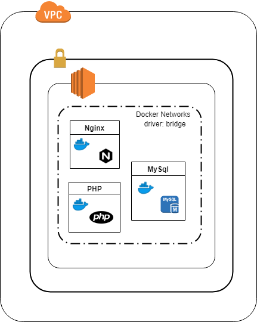

# piktorya
social-networking app

# microservices application

step 1. get a ubuntu ec2 instance. Open security groups port 80

step 2. ssh to the instance

step 3. run <code>sudo apt update</code>

step 4. install <a href="https://docs.docker.com/install/linux/docker-ce/ubuntu/" target="_blank">docker</a>

step 5. install <a href="https://docs.docker.com/compose/install/" target="_blank">docker compose</a>

step 6. run <code>git clone https://github.com/Aneeshn25/piktorya</code>
        
step 7. change the directory to piktorya <code>cd piktorya</code>

step 8. run <code>sudo docker-compose build</code>

step 9. run <code>sudo docker-compose up -d</code> run it in the background

step 10. Access piktorya app using <code>http://public_ip</code> of the instance in the http client(any web browser)

should work. if not, please try to make it work ;)

<h3> Anyone is welcome to make a pull request</h3>

<h3>Ref Docs:</h3> https://www.digitalocean.com/community/tutorials/how-to-set-up-laravel-nginx-and-mysql-with-docker-compose
